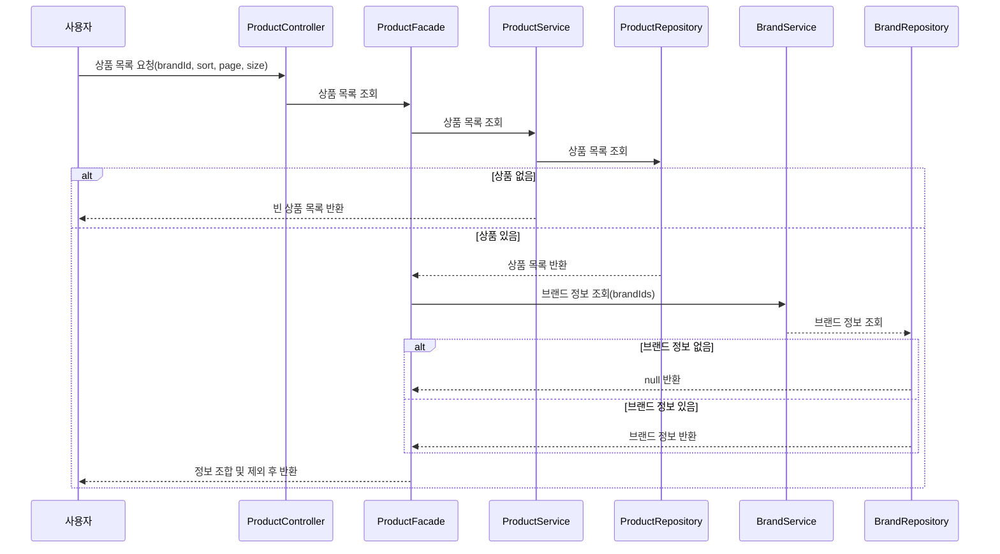
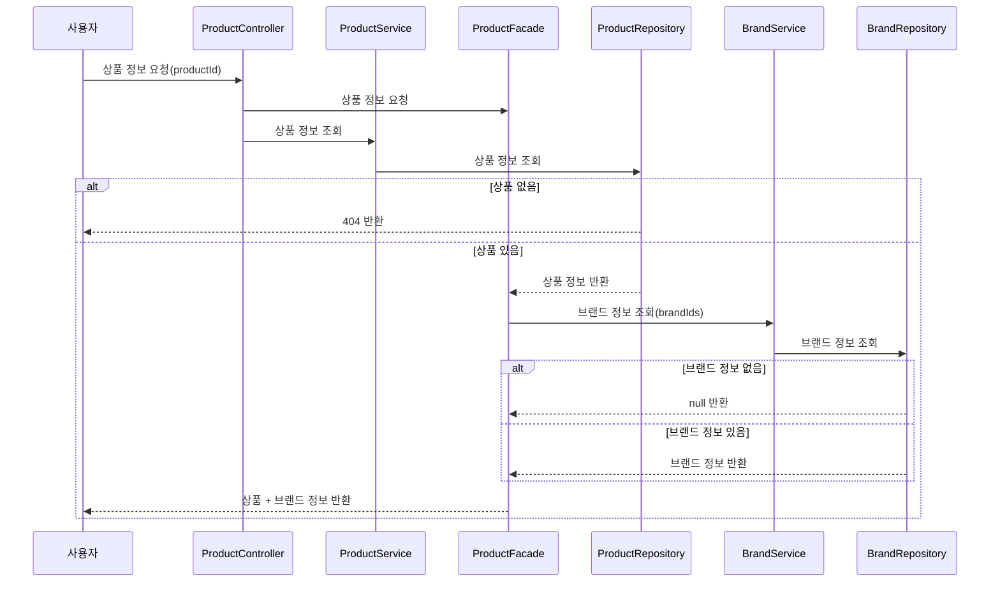
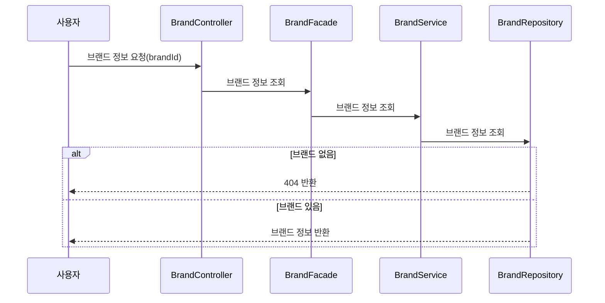
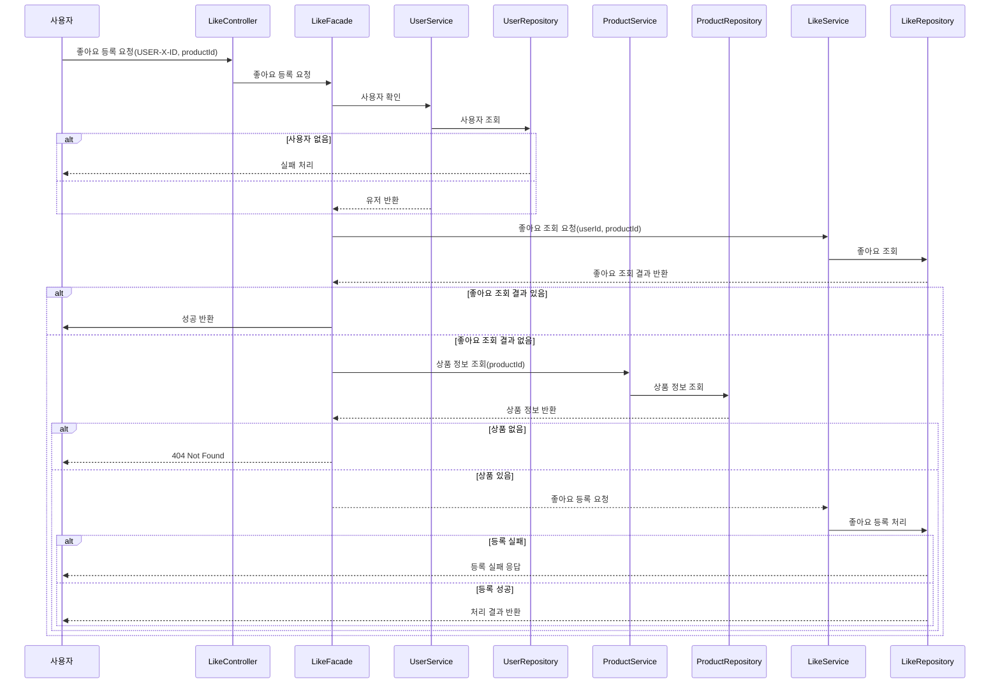
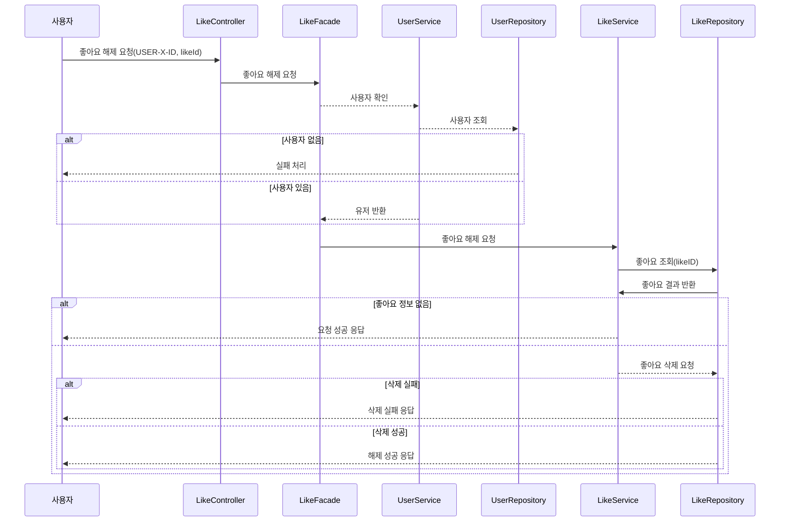
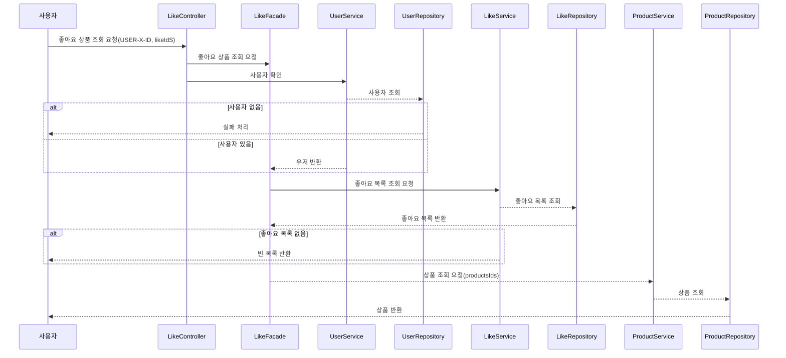
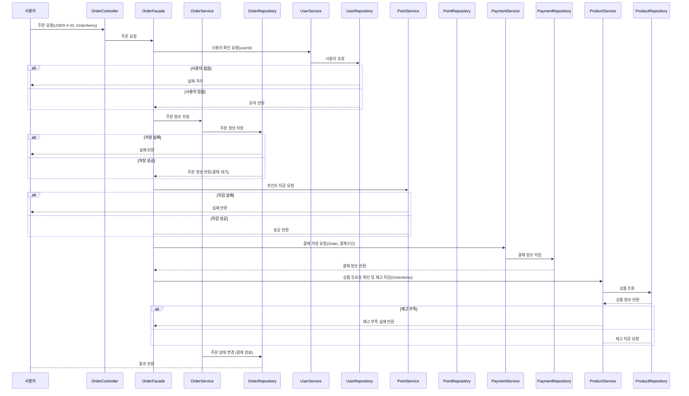

## 상품 목록 조회

```mermaid
sequenceDiagram
    participant 사용자
    participant PC as ProductController
    participant PF as ProductFacade
    participant PS as ProductService
    participant PR as ProductRepository
    participant BS as BrandService
    participant BR as BrandRepository

    사용자->>PC: 상품 목록 요청(brandId, sort, page, size)
    PC->>PF: 상품 목록 조회
    PF->>PS: 상품 목록 조회
    PS->>PR: 상품 목록 조회

    alt 상품 없음
        PS-->>사용자: 빈 상품 목록 반환
    else 상품 있음
        PR-->>PF: 상품 목록 반환
        PF->>BS: 브랜드 정보 조회(brandIds)
        BS-->>BR: 브랜드 정보 조회
        alt 브랜드 정보 없음
            BR-->>PF: null 반환
        else 브랜드 정보 있음
            BR-->>PF: 브랜드 정보 반환
        end
        PF -->> 사용자: 정보 조합 및 제외 후 반환
    end
```

## 상품 정보 조회

```mermaid
sequenceDiagram
    participant 사용자
    participant PC as ProductController
    participant PS as ProductService
    participant PF as ProductFacade
    participant PR as ProductRepository
    participant BS as BrandService
    participant BR as BrandRepository

    사용자->>PC: 상품 정보 요청(productId)
    PC->>PF: 상품 정보 요청
    PC->>PS: 상품 정보 조회
    PS->>PR: 상품 정보 조회
    alt 상품 없음
        PR-->>사용자: 404 반환
    else 상품 있음
        PR-->>PF: 상품 정보 반환
        PF->>BS: 브랜드 정보 조회(brandIds)
        BS->>BR: 브랜드 정보 조회
        alt 브랜드 정보 없음
            BR-->>PF: null 반환
        else 브랜드 정보 있음
            BR-->>PF: 브랜드 정보 반환
        end
        PF-->>사용자: 상품 + 브랜드 정보 반환
    end
```

## 브랜드 정보 조회

```mermaid
sequenceDiagram
participant 사용자
participant BC as BrandController
participant BF as BrandFacade
participant BS as BrandService
participant BR as BrandRepository

    사용자->>BC: 브랜드 정보 요청(brandId)
    BC->>BF: 브랜드 정보 조회
    BF->>BS: 브랜드 정보 조회
    BS->>BR: 브랜드 정보 조회
    alt 브랜드 없음
    BR-->>사용자: 404 반환
    else 브랜드 있음
        BR-->>사용자: 브랜드 정보 반환
    end
```

## 좋아요 등록

```mermaid
sequenceDiagram
    participant 사용자
    participant LC as LikeController
    participant LF as LikeFacade
    participant US as UserService
    participant UR as UserRepository
    participant PS as ProductService
    participant PR as ProductRepository
    participant LS as LikeService
    participant LR as LikeRepository
    
    
    
    사용자 ->> LC: 좋아요 등록 요청(USER-X-ID, productId)
    LC ->> LF: 좋아요 등록 요청
    LF ->> US: 사용자 확인
    US ->> UR: 사용자 조회
    alt 사용자 없음
        UR -->> 사용자: 실패 처리
    else
        US -->> LF: 유저 반환
    end
    LF ->> LS: 좋아요 조회 요청(userId, productId)
    LS ->> LR: 좋아요 조회
    LR -->> LF: 좋아요 조회 결과 반환
    alt 좋아요 조회 결과 있음
        LF ->> 사용자: 성공 반환
    else 좋아요 조회 결과 없음
        LF ->> PS: 상품 정보 조회(productId)
        PS ->> PR: 상품 정보 조회
        PR -->> LF: 상품 정보 반환
        alt 상품 없음
            LF -->> 사용자 : 404 Not Found
        else 상품 있음
            LF -->> LS : 좋아요 등록 요청
            LS ->> LR: 좋아요 등록 처리
            alt 등록 실패
                LR -->> 사용자: 등록 실패 응답
            else 등록 성공
                LR -->> 사용자: 처리 결과 반환
            end
        end
    end
        
        
```

## 좋아요 해제

```mermaid
sequenceDiagram
    participant 사용자
    participant LC as LikeController
    participant LF as LikeFacade
    participant US as UserService
    participant UR as UserRepository
    participant LS as LikeService
    participant LR as LikeRepository
    

    사용자 ->> LC: 좋아요 해제 요청(USER-X-ID, likeId)
    LC ->> LF: 좋아요 해제 요청
    LF -->> US: 사용자 확인
    US -->> UR: 사용자 조회
    alt 사용자 없음
        UR -->> 사용자: 실패 처리
    else 사용자 있음
        US -->> LF: 유저 반환
    end
    LF ->> LS: 좋아요 해제 요청
    LS ->> LR: 좋아요 조회(likeID)
    LR ->> LS: 좋아요 결과 반환
    alt 좋아요 정보 없음
        LS -->> 사용자: 요청 성공 응답
    else
        LS -->> LR: 좋아요 삭제 요청
        alt 삭제 실패
            LR -->> 사용자: 삭제 실패 응답
        else 삭제 성공
            LR -->> 사용자: 해제 성공 응답
        end
    end
    

```

## 내가 좋아요한 샹품 목록

```mermaid
sequenceDiagram
    participant 사용자
    participant LC as LikeController
    participant LF as LikeFacade
    participant US as UserService
    participant UR as UserRepository
    participant LS as LikeService
    participant LR as LikeRepository
    participant PS as ProductService
    participant PR as ProductRepository
    

    사용자 ->> LC: 좋아요 상품 조회 요청(USER-X-ID, likeIdS)
    LC ->> LF: 좋아요 상품 조회 요청
    LC ->> US: 사용자 확인
    US -->> UR: 사용자 조회
    alt 사용자 없음
        UR -->> 사용자: 실패 처리
    else 사용자 있음
        US -->> LF: 유저 반환
    end
    LF ->> LS: 좋아요 목록 조회 요청
    LS -->> LR: 좋아요 목록 조회
    LR -->> LF: 좋아요 목록 반환
    alt 좋아요 목록 없음
        LS -->> 사용자: 빈 목록 반환
    end
    LF -->> PS: 상품 조회 요청(productsIds)
    PS -->> PR: 상품 조회
    PR -->> 사용자: 상품 반환
    
```

### 주문 / 결재

```mermaid
sequenceDiagram
    participant 사용자
    participant OC as OrderController
    participant OF as OrderFacade
    participant OS as OrderService
    participant OR as OrderRepository
    participant US as UserService
    participant UR as UserRepository
    participant PtS as PointService
    participant PtR as PointRepository
    participant PayS as PaymentService
    participant PayR as PaymentRepository
    participant PS as ProductService
    participant PR as ProductRepository

    사용자 ->> OC: 주문 요청(USER-X-ID, OrderItems)
    OC ->> OF: 주문 요청
    OF ->> US: 사용자 확인 요청(userId)
    US ->> UR: 사용자 조회
    alt 사용자 없음
        UR -->> 사용자: 실패 처리
    else 사용자 있음
        UR -->> OF: 유저 반환
    end
    OF ->> OS: 주문 정보 저장
    OS ->> OR: 주문 정보 저장
    alt 저장 실패
        OR -->> 사용자: 실패 반환
    else 저장 성공
        OR -->> OF: 주문 정보 반환(결제 대기)
    end
    OF ->> PtS: 포인트 차감 요청
    alt 차감 실패
        PtS -->>사용자: 실패 반환
    else 차감 성공
        PtS -->OF:성공 반환
    end
    OF ->> PayS: 결제 저장 요청(Order, 결제수단)
    PayS ->> PayR: 결제 정보 저장
    PayR -->> OF: 결재 정보 반환
    OF ->> PS: 상품 유효성 확인 및 재고 차감(OrderItems)
    PS ->> PR: 상품 조회
    PR -->> PS: 상품 정보 반환
    alt 재고 부족 
        PS -->> OF: 재고 부족 실패 반환
    else
        PS --> PR: 재고 차감 요청
    end
    OS ->> OR: 주문 상태 변경 (결제 완료)
    OR --> 사용자 : 결과 반환
    
    
```