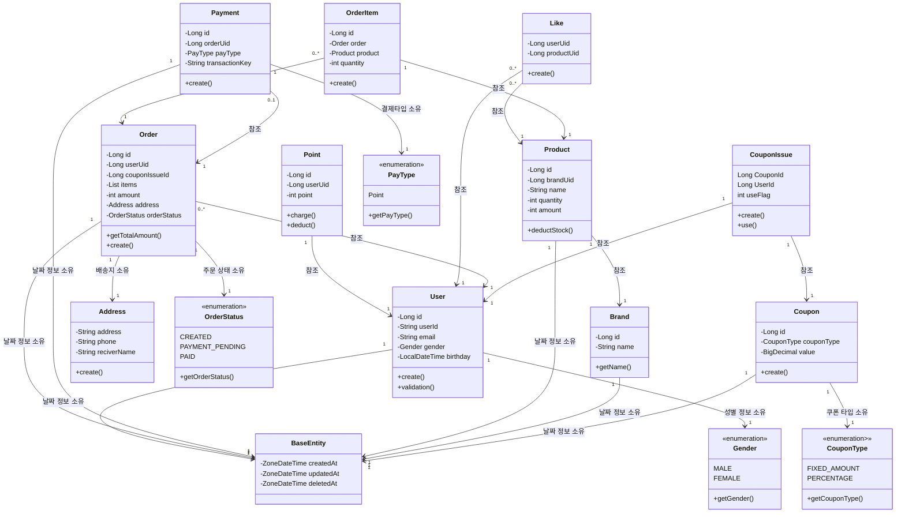

```mermaid
%% + : public
%% - : private
%% # : protected

classDiagram
    class BaseEntity {
        -ZoneDateTime createdAt
        -ZoneDateTime updatedAt
        -ZoneDateTime deletedAt
    }
    class User {
        -Long id
        -String userId
        -String email
        -Gender gender
        -LocalDateTime birthday
        %% 유저 생성
        +create()
        %% 유저 생성 검증
        +validation()
    }
    class Gender {
        <<enumeration>>
        MALE
        FEMALE
        %% gender 반환
        +getGender()
    }

    class Point {
        -Long id
        -Long userUid
        -int point
        %%포인트 충전
        +charge()
        %%포인트 차감
        +deduct()
    }

    class Brand {
        -Long id
        -String name
        %% 이름 반환
        +getName()
    }

    class Product {
        -Long id
        -Long brandUid
        -String name
        -int quantity
        -int amount
        %% 재고 차감
        +deductStock()
    }

    class Like {
        -Long userUid
        -Long productUid
        %% 좋아요 생성
        +create()
    }

    class Order {
        -Long id
        -Long userUid
        -Long couponIssueId
        -List<OrderItem> items
        -int amount
        -Address address
        -OrderStatus orderStatus
        %% 주문 총 금액 반환
        +getTotalAmount()
        %% 주문 생성
        +create()
    }
    class Address {
        -String address
        -String phone
        -String reciverName
        %% 배송정보 생성
        +create()
    }
    class OrderStatus {
        <<enumeration>>
        CREATED
        PAYMENT_PENDING
        PAID
        %% order 상태 반환
        +getOrderStatus()
    }

    class OrderItem {
        -Long id
        -Order order
        -Product product
        -int quantity
        %% 주문 아이템 생성
        +create()
    }

    class Payment {
        -Long id
        -Long orderUid
        -PayType payType
        -String transactionKey
        %% 결제 생성
        +create()
    }
    class PayType {
        <<enumeration>>
        Point
        %% 결제 타입 반환
        +getPayType()
    }
    class Coupon {
        -Long id
        -CouponType couponType
        -BigDecimal value
        +create()
    }
    
    class CouponType {
        <<enumeration>>>
        FIXED_AMOUNT
        PERCENTAGE
        +getCouponType()
    }
    
    class CouponIssue {
        Long CouponId
        Long UserId
        int useFlag
        +create()
        +use()
    }

    Point "1" --> "1" User : 참조
    Product "1" --> "1" Brand : 참조
    Like "0..*" --> "1" Product : 참조
    Like "0..*" --> "1" User : 참조
    Order "0..*" --> "1" User : 참조
    OrderItem "0..*" --> "1" Order : 참조
    OrderItem "1" --> "1" Product : 참조
    Order "1" --> "1" Address : 배송지 소유
    Order "1" --> "1" OrderStatus : 주문 상태 소유
    Payment "0..1" --> "1" Order : 참조
    Payment "1" --> "1" PayType : 결제타입 소유
    User "1" --> "1" Gender : 성별 정보 소유
    User "1" --> "1" BaseEntity : 날짜 정보 소유
    Order "1" --> "1" BaseEntity : 날짜 정보 소유
    Payment "1" --> "1" BaseEntity : 날짜 정보 소유
    Product "1" --> "1" BaseEntity : 날짜 정보 소유
    Brand "1" --> "1" BaseEntity : 날짜 정보 소유
    Coupon "1" --> "1"BaseEntity : 날짜 정보 소유
    Coupon "1" --> "1"CouponType : 쿠폰 타입 소유
    CouponIssue "1" --> "1" Coupon : 참조
    CouponIssue "1" --> "1" User : 참조
```