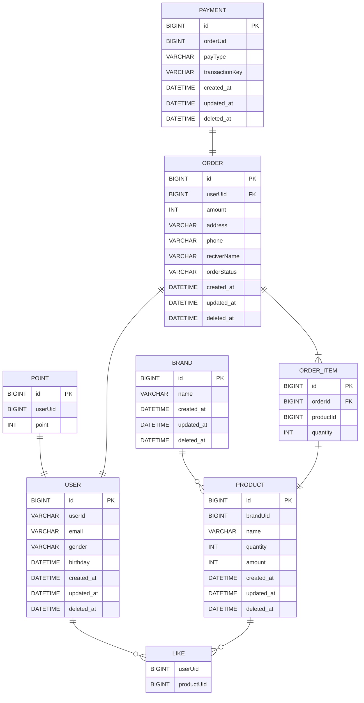

```mermaid
erDiagram
    USER {
        BIGINT id PK
        VARCHAR userId
        VARCHAR email
        VARCHAR gender
        DATETIME birthday
        DATETIME created_at
        DATETIME updated_at
        DATETIME deleted_at
    }

    POINT {
        BIGINT id PK
        BIGINT userUid
        INT point
    }

    BRAND {
        BIGINT id PK
        VARCHAR name
        DATETIME created_at
        DATETIME updated_at
        DATETIME deleted_at
    }

    PRODUCT {
        BIGINT id PK
        BIGINT brandUid
        VARCHAR name
        INT quantity
        INT amount
        DATETIME created_at
        DATETIME updated_at
        DATETIME deleted_at
    }

    LIKE {
        BIGINT userUid
        BIGINT productUid
    }

    ORDER {
        BIGINT id PK
        BIGINT userUid FK
        INT amount
        VARCHAR address
        VARCHAR phone
        VARCHAR reciverName
        VARCHAR orderStatus
        DATETIME created_at
        DATETIME updated_at
        DATETIME deleted_at
    }

    ORDER_ITEM {
        BIGINT id PK
        BIGINT orderId FK
        BIGINT productId
        INT quantity
    }

    PAYMENT {
        BIGINT id PK
        BIGINT orderUid
        VARCHAR payType
        VARCHAR transactionKey
        DATETIME created_at
        DATETIME updated_at
        DATETIME deleted_at
    }

%% 관계 정의
    POINT ||--|| USER : ""
    BRAND ||--o{ PRODUCT : ""
    USER ||--o{ LIKE: ""
    PRODUCT ||--o{ LIKE: ""
    ORDER ||--|{ ORDER_ITEM : ""
    ORDER ||--|| USER : ""
    ORDER_ITEM ||--|| PRODUCT : ""
    PAYMENT ||--|| ORDER : ""

```